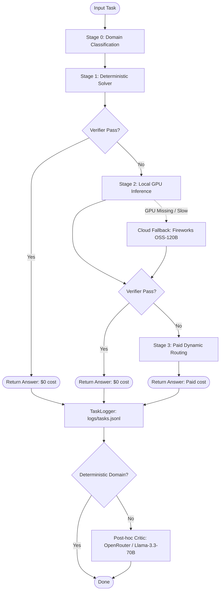

# AMD Developer Cloud — LLM Routing Agent

A hybrid, token-efficient LLM routing agent built for the AMD Developer Cloud competition. The objective of this agent is to maximize classification and generation accuracy while minimizing paid token usage.

## 🎯 Scoring Metric

The agent is optimized against the following performance metric:

$$\text{Score} = \frac{\text{Accuracy}}{\text{Total Paid Token Cost}}$$

To maximize this score, the agent uses a **4-stage cascading architecture** where simple tasks are solved using zero-cost methods (rules, libraries, or free local models) and only high-complexity or failed tasks escalate to paid LLMs.

---

## 🏗️ Cascading Architecture (Phase 1)

Every incoming task is processed sequentially through the following pipeline stages:



---

## 🛠️ Detailed Stage Breakdown

### 1. Stage 0: Domain Classifier ([domain.py](file:///c:/Users/Rama%20Bolishetty/OneDrive/Desktop/amd_v2/router/domain.py))
* Maps prompts into 8 distinct domains: Factual Knowledge, Math Reasoning, Sentiment Classification, Summarization, NER, Code Debugging, Logical Reasoning, and Code Generation.
* **Semantic Matcher**: Computes cosine similarity of prompt sentence embeddings using a local `all-MiniLM-L6-v2` transformer model.
* **Keyword Fallback**: If `sentence-transformers` is missing (e.g. CPU environment), the classifier falls back to a regex-based keyword and structure matching heuristic.

### 2. Stage 1: Deterministic Solvers ([stage1.py](file:///c:/Users/Rama%20Bolishetty/OneDrive/Desktop/amd_v2/router/stage1.py))
Handles 5 out of 8 domains with $0 cost rules or libraries:
* **Math Solver** ([math_tool.py](file:///c:/Users/Rama%20Bolishetty/OneDrive/Desktop/amd_v2/router/tools/math_tool.py)): Parses and solves algebraic/numeric expressions using `SymPy`.
* **Sentiment Analyzer** ([sentiment_tool.py](file:///c:/Users/Rama%20Bolishetty/OneDrive/Desktop/amd_v2/router/tools/sentiment_tool.py)): Processes sentiment using the rule-based `VADER` lexicon.
* **NER** ([ner_tool.py](file:///c:/Users/Rama%20Bolishetty/OneDrive/Desktop/amd_v2/router/tools/ner_tool.py)): Extracts entities using `spaCy` (`en_core_web_sm`).
* **Logic Solver** ([logic_tool.py](file:///c:/Users/Rama%20Bolishetty/OneDrive/Desktop/amd_v2/router/tools/logic_tool.py)): Evaluates logic riddles/SAT formulas using a `Z3` solver.
* **Code Sandbox** ([sandbox.py](file:///c:/Users/Rama%20Bolishetty/OneDrive/Desktop/amd_v2/router/tools/sandbox.py)): A secure, subprocess-based environment executing Python code snippets under custom memory limits and timeouts.

### 3. Stage 2: Local GPU Inference via Ollama ([stage2.py](file:///c:/Users/Rama%20Bolishetty/OneDrive/Desktop/amd_v2/router/stage2.py))
* Connects to a local Ollama instance running on ROCm. Defaults to `llama3.2:3b` across all domains.
* **Health Check & Latency Fallback** ([health.py](file:///c:/Users/Rama%20Bolishetty/OneDrive/Desktop/amd_v2/router/health.py)): During startup, checks local GPU state. If local inference fails or exceeds latency thresholds, the pipeline falls back to cloud models (`gpt-oss-120b` on Fireworks) and marks them in billing records.

### 4. Stage 3: Paid Dynamic Routing ([stage3.py](file:///c:/Users/Rama%20Bolishetty/OneDrive/Desktop/amd_v2/router/stage3.py))
* Escales hard tasks to paid APIs (Groq during local tests, Fireworks in production).
* **Complexity Matching**: Evaluates prompts based on character length, logic keywords, and code markers to select the cheapest adequate model (from `gpt-oss-120b`, `kimi-k2p6`, `glm-5p1`, `glm-5p2`, to `deepseek-v4-pro`).
* **Self-Correction**: Runs up to 3 attempts. When output fails validation, the system feeds back compiler/parser error messages for an agentic self-correction retry.

### 5. Verification & Critique Framework ([verifiers.py](file:///c:/Users/Rama%20Bolishetty/OneDrive/Desktop/amd_v2/router/verifiers.py), [critique.py](file:///c:/Users/Rama%20Bolishetty/OneDrive/Desktop/amd_v2/router/critique.py))
* Domain-specific verifiers validate outputs from Stages 1 & 2 before deciding whether to exit early or escalate.
* For domains without a deterministic parser/verifier (Factual Knowledge, Summarization, Logical Reasoning), an LLM critic evaluates the answer (using OpenRouter/local fallback) for training data labeling.

### 6. Pipeline Orchestrator & Telemetry ([pipeline.py](file:///c:/Users/Rama%20Bolishetty/OneDrive/Desktop/amd_v2/router/pipeline.py), [task_log.py](file:///c:/Users/Rama%20Bolishetty/OneDrive/Desktop/amd_v2/router/task_log.py))
* Sequentially coordinates execution across stages.
* Automatically records detailed metadata (inferred domain, executing stage, latency, output, paid token count, and calculated cost) into `logs/tasks.jsonl` for offline analysis and Phase 2 training.

---

## 📂 Codebase Layout

```
.
├── plan/                   # [plan/](file:///c:/Users/Rama%20Bolishetty/OneDrive/Desktop/amd_v2/plan) Competition planning and methodology documents
├── router/                 # [router/](file:///c:/Users/Rama%20Bolishetty/OneDrive/Desktop/amd_v2/router) Pipeline core logic
│   ├── providers/          # [providers/](file:///c:/Users/Rama%20Bolishetty/OneDrive/Desktop/amd_v2/router/providers) LLM API providers (Ollama, Groq, Fireworks)
│   ├── tools/              # [tools/](file:///c:/Users/Rama%20Bolishetty/OneDrive/Desktop/amd_v2/router/tools) Stage 1 deterministic tool wrappers and sandboxing
│   ├── batch.py            # [batch.py](file:///c:/Users/Rama%20Bolishetty/OneDrive/Desktop/amd_v2/router/batch.py) Dataset batch-runner
│   ├── config.py           # [config.py](file:///c:/Users/Rama%20Bolishetty/OneDrive/Desktop/amd_v2/router/config.py) Configuration loading & settings
│   ├── pipeline.py         # [pipeline.py](file:///c:/Users/Rama%20Bolishetty/OneDrive/Desktop/amd_v2/router/pipeline.py) Main execution pipeline
│   ├── verifiers.py        # [verifiers.py](file:///c:/Users/Rama%20Bolishetty/OneDrive/Desktop/amd_v2/router/verifiers.py) Stage exit validation verifiers
│   └── types.py            # [types.py](file:///c:/Users/Rama%20Bolishetty/OneDrive/Desktop/amd_v2/router/types.py) Enums, Dataclasses, Type aliases
├── tests/                  # [tests/](file:///c:/Users/Rama%20Bolishetty/OneDrive/Desktop/amd_v2/tests) Unit and integration tests for every module
├── pyproject.toml          # [pyproject.toml](file:///c:/Users/Rama%20Bolishetty/OneDrive/Desktop/amd_v2/pyproject.toml) Project package definitions
├── requirements.txt        # [requirements.txt](file:///c:/Users/Rama%20Bolishetty/OneDrive/Desktop/amd_v2/requirements.txt) Hard requirements (CPU-safe libraries)
└── requirements-optional.txt # [requirements-optional.txt](file:///c:/Users/Rama%20Bolishetty/OneDrive/Desktop/amd_v2/requirements-optional.txt) Soft dependencies (spacy, sentence-transformers, lightgbm)
```

---

## 🚀 Getting Started

### Installation

1. Create and activate a python virtual environment:
   ```bash
   python -m venv .venv
   .venv\Scripts\activate    # Windows
   source .venv/bin/activate  # macOS/Linux
   ```
2. Install the required dependencies:
   ```bash
   pip install -r requirements.txt
   ```
3. (Optional) Install NLP and embeddings libraries:
   ```bash
   pip install -r requirements-optional.txt
   python -m spacy download en_core_web_sm
   ```

### Configuration

Configure settings via environment variables (or let them fallback to defaults in [config.py](file:///c:/Users/Rama%20Bolishetty/OneDrive/Desktop/amd_v2/router/config.py)):
```bash
# Provider Configuration
export PAID_PROVIDER="fireworks" # or "groq"
export FIREWORKS_API_KEY="your-api-key"
export GROQ_API_KEY="your-api-key"
export OLLAMA_HOST="http://localhost:11434"

# Settings & Thresholds
export LOCAL_MAX_LATENCY_S="3.0"
export TASK_LOG_PATH="logs/tasks.jsonl"
```

### Running Tests

To run the full validation test suite (120 tests):
```bash
python -m pytest
```

### Running the CLI Agent (Bare-Metal)

You can run the routing agent directly over any dataset in JSONL or CSV format:
```bash
python -m router.main --input <path_to_dataset> --output <path_to_results.jsonl>
```
* **Example**:
  ```bash
  python -m router.main --input fixtures/sample_tasks.jsonl --output logs/results.jsonl
  ```

### Running the Offline Routing Evaluator

To run a parameter sweep across all routing thresholds and logic gates to determine the Pareto frontier (Accuracy vs. Cost):
```bash
python scripts/evaluate_routing.py
```

### Running with Docker

For instructions on building the container image and running with GPU/ROCm passthrough, see the [RUNNING.md](file:///c:/Users/Rama%20Bolishetty/OneDrive/Desktop/amd_v2/RUNNING.md) guide.
